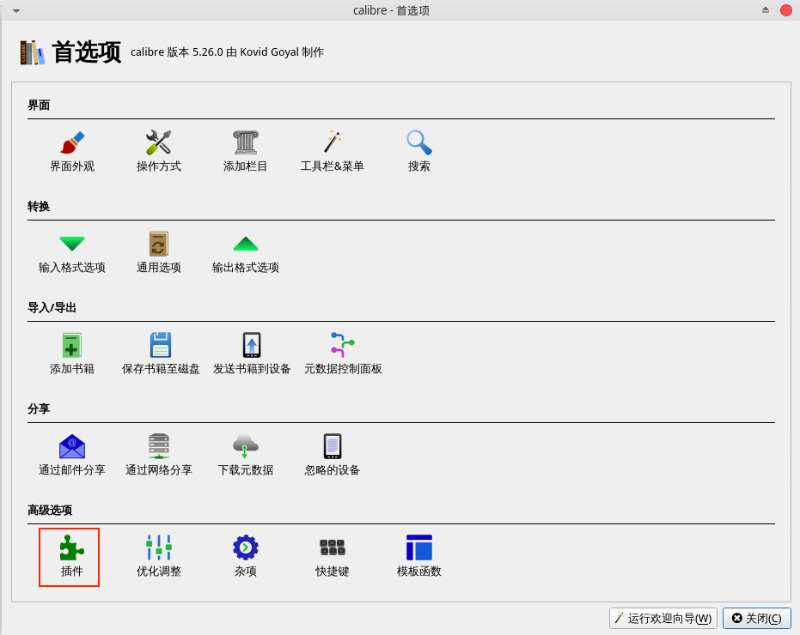
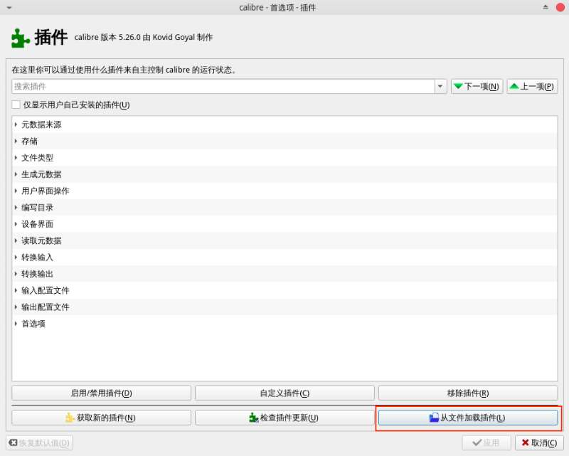

# Calibre CBZ Convertor
Plugin to convert comic book to cbz (zip) format

# How to install

(1) in `Terminal.app` or your prefer command line terminal

```bash
git clone https://github.com/huyumars/calibre-cbz-convertor.git
cd calibre-cbz-convertor
make zip
```

You will be able to locate a `cbz.zip` in the folder, please remember the path

(2) launch the `calibre` application

(3) launch the `Prefernces` page, click the `Plugins` icon



(4) click the `Load plugin from file` button, and choose `cbz.zip` from step (1)



(5) enjoy!
